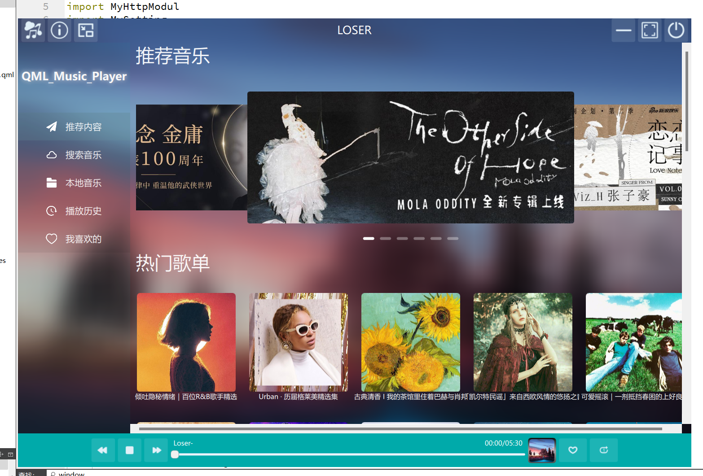
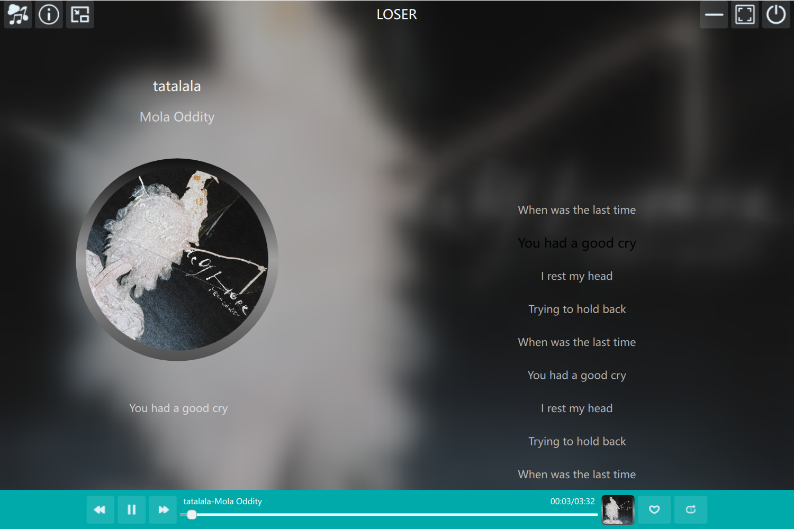
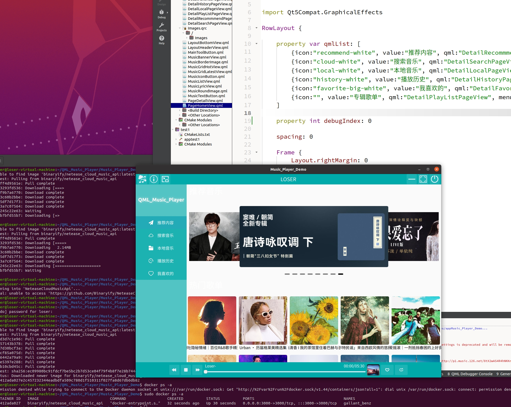

学习QML写个项目
—————————————————————————————————————————————————

使用Qt Quick QML开发的Windows/linux 一款云音乐播放器程序

实现了搜索音乐、播放音乐、历史记录、我喜欢等功能

运用了RowLayout、ColumnLayout、Grid等布局

使用了ListView进行列表展示、歌词滚动

使用MediaPlayer实现音乐播放

封装Settings实现历史记录、我喜欢等数据存储

有部分自定义组件、动画运用

使用了系统托盘图标功能

网络请求中使用了C++与qml交互

用到了Docker容器运行搜索服务程序，一些基础的Docker操作
———————————————————————————————————————————————

音乐搜索使用以下开源API 详细查看在线文档

[网易云音乐 NodeJS 版 API (neteasecloudmusicapi.js.org)](https://neteasecloudmusicapi.js.org/#/)
windows下运行

linux下运行(没改背景版本)

